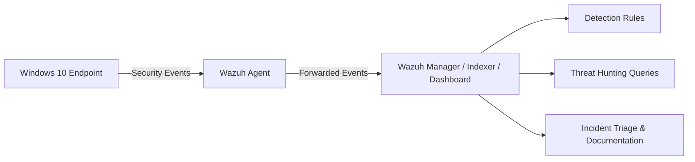

# SOC Lab — Wazuh SIEM (Windows Endpoint)

Personal SOC lab built with **Wazuh SIEM** and a **Windows 10 endpoint** to practice log validation, detection engineering, threat hunting, alert triage, and incident documentation using a realistic analyst workflow.

This project focuses on building **stable, explainable detections** from **native Windows Security logs**, documenting the investigation process, and making design decisions that reflect constrained or production-aware environments rather than idealized setups.

---

## What This Project Demonstrates

This lab was built to simulate core responsibilities of a SOC analyst:

- Validate available telemetry before writing detections
- Investigate Windows security events and suspicious activity
- Create and tune Wazuh detection rules
- Perform analyst-style triage and alert review
- Map activity to **MITRE ATT&CK**
- Document incidents, detection logic, and lessons learned
- Prioritize **stability and signal quality** over overly complex detections

---

## Lab Architecture

### Components

- **SIEM:** Wazuh 4.14.1 (All-in-One OVA)
- **Endpoint:** Windows 10 Pro
- **Agent:** Wazuh Agent 4.14.1
- **Network:** VirtualBox Host-Only (`192.168.56.0/24`)

### Telemetry

- **Log source:** Windows Security Event Log
- **Collection method:** Wazuh Agent via Windows Event Channel

### Architecture Diagram

---

## Detection Use Cases

Each detection case documents a full SOC-style workflow including:

- threat hypothesis
- log validation
- detection logic
- investigation steps
- triage notes
- severity assessment
- tuning considerations
- lessons learned

### Cases

- [Case 01 — Local User Creation & Privilege Escalation](./case-1-user-admin/README.md)
- [Case 02 — Persistence via Scheduled Task](./case-2-persistence-scheduled-task/README.md)
- [Case 03 — Failed Logons / Brute Force](./case-3-failed-logons-bruteforce/README.md)
- [Case 04 — Suspicious PowerShell Execution (LOLBins)](./case-4-suspicious-powershell-execution/README.md)

---

## Investigation Workflow

The workflow used in this lab follows a practical SOC process:

1. **Generate activity in the lab**
2. **Confirm telemetry exists and is usable**
3. **Validate raw events in Wazuh**
4. **Identify relevant fields and parent rules**
5. **Write or tune a detection**
6. **Trigger and verify the alert**
7. **Investigate the event in analyst style**
8. **Document findings, false positives, and tuning decisions**

This project intentionally treats detection engineering as more than “rule writing.”  
The focus is on whether an alert is reliable, explainable, and operationally useful.

---

## Reusable Documentation

Additional SOC-focused documentation is included to support reusable workflows and investigation practices:

- [SOC Detection Methodology](./docs/SOC-Detection-Methodology.md)
- [Wazuh Rule Creation Notes](./docs/Wazuh_Rule_Creation_Notes.md)
- [Wazuh Query Cookbook](./docs/Wazuh_Query_Cookbook.md)

These notes document practical detection engineering considerations such as:

- validating log availability before building rules
- using `if_sid` correctly
- handling `no_full_log` limitations
- choosing stable fields over fragile matches
- troubleshooting rule failures in Wazuh

---

## Skills Demonstrated

This project demonstrates hands-on practice in:

- Wazuh SIEM deployment and administration
- Windows Security Event analysis
- Threat hunting using Wazuh queries / DQL
- Detection engineering with native Windows logs
- Custom Wazuh rule development
- Alert validation and tuning
- MITRE ATT&CK mapping
- SOC-style incident triage and documentation
- Debugging failed or unstable detections

---

## MITRE ATT&CK Coverage

| Case | Detection Focus | ATT&CK Technique |
|------|------------------|------------------|
| 01 | Local user creation / admin group membership | T1136.001, T1098 |
| 02 | Scheduled task persistence | T1053.005 |
| 03 | Failed logons / brute force behavior | T1110 |
| 04 | Suspicious PowerShell execution | T1059.001 |

> ATT&CK mappings are included to connect raw Windows events with recognizable adversary behavior and improve detection context.

---

## Key Lessons Learned

A few important lessons from this lab:

- **Telemetry comes first.** A detection is only useful if the required logs actually exist and are parsed correctly.
- **Stable detections are more valuable than clever detections.**
- **Native Windows logs still provide meaningful detection opportunities** in constrained environments.
- **Rule tuning is part of detection engineering**, not an afterthought.
- **Documentation matters.** A useful alert should be reproducible, explainable, and investigable.

---

## Scope and Limitations

This lab is intentionally scoped and does not attempt to simulate a full enterprise environment.

Current limitations:

- focused on **Windows endpoint monitoring**
- uses **native Windows Security logs**
- no **Sysmon**
- no commercial **EDR**
- no multi-host correlation beyond the current lab scope
- Linux detection content is planned for future expansion

This constraint is intentional: the goal is to build effective detections from the telemetry that is actually available.

---

## Next Steps

Planned improvements for the project:

- add a formal **ATT&CK coverage matrix**
- separate reusable rules and queries into dedicated folders
- standardize all cases with the same reporting structure
- add a correlation-based detection case
- expand the lab with Linux telemetry
- evaluate adding Sysmon in a future version for comparison

---

## Disclaimer

This project is for **educational and portfolio purposes only**.

All activity was performed in an isolated lab environment.
