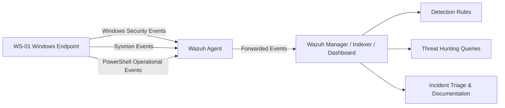

# SOC Lab — Wazuh SIEM (Enhanced Windows Endpoint Monitoring)

Personal SOC lab built with **Wazuh SIEM** and a monitored **Windows endpoint** to practice log validation, detection engineering, threat hunting, alert triage, and incident documentation using a realistic analyst workflow.

This project focuses on building **stable, explainable detections** from Windows telemetry, documenting the investigation process, and making design decisions that reflect constrained or production-aware environments rather than idealized setups.

The lab originally started with native Windows Security logs and has now evolved to include **Sysmon** and **PowerShell Script Block Logging** for stronger endpoint visibility and better investigative context.

---

## What This Project Demonstrates

This lab was built to simulate core responsibilities of a SOC analyst:

- Validate available telemetry before writing detections
- Investigate Windows security events and suspicious activity
- Create and tune Wazuh detection rules
- Perform analyst-style triage and alert review
- Map activity to **MITRE ATT&CK**
- Document incidents, detection logic, and lessons learned
- Correlate telemetry from multiple log sources
- Prioritize **stability and signal quality** over overly complex detections

---

## Lab Architecture

### Components

- **SIEM:** Wazuh 4.14.1 (All-in-One OVA)
- **Endpoint:** Windows 10 Home Single Language (`WS-01`)
- **Agent:** Wazuh Agent 4.14.1
- **Hypervisor:** VirtualBox
- **Additional Telemetry:**
  - Sysmon
  - PowerShell Script Block Logging

### Telemetry

- **Windows Security Event Log**
- **Microsoft-Windows-Sysmon/Operational**
- **Microsoft-Windows-PowerShell/Operational**

### Network Overview

- **Wazuh Dashboard / management access:** `192.168.56.101`
- **Wazuh Manager IP used by the agent:** `192.168.0.102`

This reflects the practical lab configuration used to allow the monitored Windows endpoint to communicate successfully with the virtualized Wazuh server.

### Architecture Diagram

---

## Detection Use Cases

Each detection case documents a full SOC-style workflow including:

- threat hypothesis
- log validation
- detection logic
- investigation steps
- triage notes
- severity assessment
- tuning considerations
- lessons learned

### Cases

- [Case 01 — Local User Creation & Privilege Escalation](./case-1-user-admin/README.md)
- [Case 02 — Persistence via Scheduled Task](./case-2-persistence-scheduled-task/README.md)
- [Case 03 — Failed Logons / Brute Force](./case-3-failed-logons-bruteforce/README.md)
- [Case 04 — Suspicious PowerShell Execution (LOLBins)](./case-4-suspicious-powershell-execution/README.md)
- [Case 05 — PowerShell Execution Correlated with Sysmon and Script Block Logging](./case-5-powershell-sysmon-correlation/README.md)

---

## Investigation Workflow

The workflow used in this lab follows a practical SOC process:

1. **Generate activity in the lab**
2. **Confirm telemetry exists and is usable**
3. **Validate raw events in Wazuh**
4. **Identify relevant fields, parent rules, or telemetry sources**
5. **Write or tune a detection when appropriate**
6. **Trigger and verify the alert or event**
7. **Investigate the activity in analyst style**
8. **Document findings, false positives, and tuning decisions**

This project intentionally treats detection engineering as more than “rule writing.”  
The focus is on whether a detection is reliable, explainable, and operationally useful.

---

## Reusable Documentation

Additional SOC-focused documentation is included to support reusable workflows and investigation practices:

- [SOC Detection Methodology](./docs/SOC-Detection-Methodology.md)
- [Wazuh Rule Creation Notes](./docs/Wazuh_Rule_Creation_Notes.md)
- [Wazuh Query Cookbook](./docs/Wazuh_Query_Cookbook.md)
- [ATT&CK Coverage Matrix](./docs/ATTACK-Coverage-Matrix.md)
- [Architecture](./architecture/README.md)

These notes document practical detection engineering considerations such as:

- validating log availability before building rules
- using `if_sid` correctly
- handling `no_full_log` limitations
- choosing stable fields over fragile matches
- understanding differences between telemetry sources
- troubleshooting rule failures and ingestion issues in Wazuh

---

## Skills Demonstrated

This project demonstrates hands-on practice in:

- Wazuh SIEM deployment and administration
- Windows Security Event analysis
- Sysmon-based host telemetry analysis
- PowerShell logging analysis
- Threat hunting using Wazuh queries / DQL
- Detection engineering with Windows telemetry
- Custom Wazuh rule development
- Alert validation and tuning
- MITRE ATT&CK mapping
- SOC-style incident triage and documentation
- Debugging failed or unstable detections
- Correlating process creation with script execution content

---

## MITRE ATT&CK Coverage

| Case | Detection Focus | ATT&CK Technique |
|------|------------------|------------------|
| 01 | Local user creation / admin group membership | T1136.001, T1098 |
| 02 | Scheduled task persistence | T1053.005 |
| 03 | Failed logons / brute force behavior | T1110 |
| 04 | Suspicious PowerShell execution | T1059.001 |
| 05 | Correlated PowerShell execution with Sysmon + 4104 | T1059.001 |

> ATT&CK mappings are included to connect raw Windows events with recognizable adversary behavior and improve detection context.

---

## Key Lessons Learned

A few important lessons from this lab:

- **Telemetry comes first.** A detection is only useful if the required logs actually exist and are parsed correctly.
- **Stable detections are more valuable than clever detections.**
- **Enriched endpoint telemetry improves investigation quality.**
- **Sysmon and PowerShell logging complement each other.**
- **Rule tuning is part of detection engineering**, not an afterthought.
- **Documentation matters.** A useful alert should be reproducible, explainable, and investigable.
- **One user action can generate multiple relevant security events**, and correlating them often provides better context than relying on a single alert.

---

## Scope and Limitations

This lab is intentionally scoped and does not attempt to simulate a full enterprise environment yet.

Current limitations:

- focused on **Windows endpoint monitoring**
- currently centered on **a single monitored endpoint**
- no commercial **EDR**
- no Active Directory yet
- no firewall or IDS layer yet
- no multi-host correlation beyond the current lab scope
- Linux detection content is planned for future expansion

These constraints are intentional: the goal is to build effective detections from the telemetry that is actually available and to evolve the lab in realistic phases.

---

## Current Project Evolution

This lab has evolved from a basic Windows log collection setup into a more capable endpoint monitoring environment that now includes:

- a monitored Windows endpoint (`WS-01`)
- Sysmon-based host telemetry
- PowerShell Script Block Logging
- improved visibility into process creation and script execution
- correlation between process execution and script content
- stronger analyst workflow for investigation and documentation

---

## Next Steps

Planned improvements for the project:

- add an **Active Directory** domain controller to simulate a more corporate environment
- add a second managed host for richer event correlation
- create custom rules based on Sysmon and PowerShell telemetry
- add a formal case for **EncodedCommand** or more advanced PowerShell abuse
- evaluate adding **SOAR** in a later phase
- expand the lab with Linux telemetry
- continue improving detection coverage and architecture maturity

---

## Disclaimer

This project is for **educational and portfolio purposes only**.

All activity was performed in an isolated lab environment.

