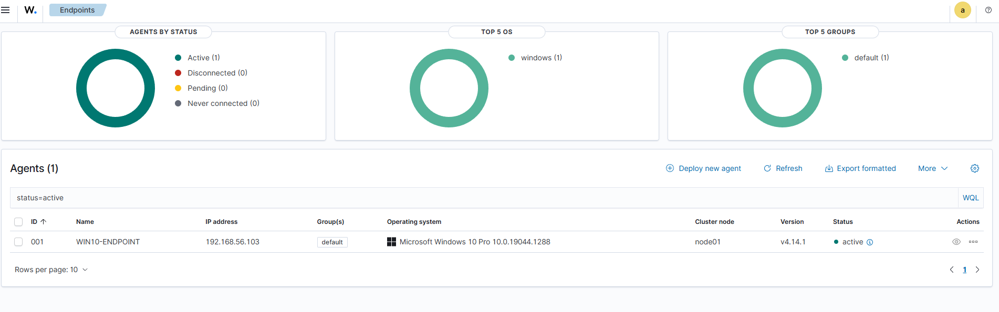
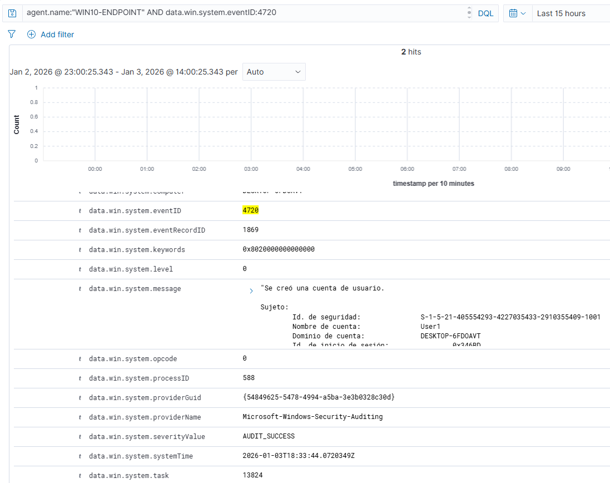
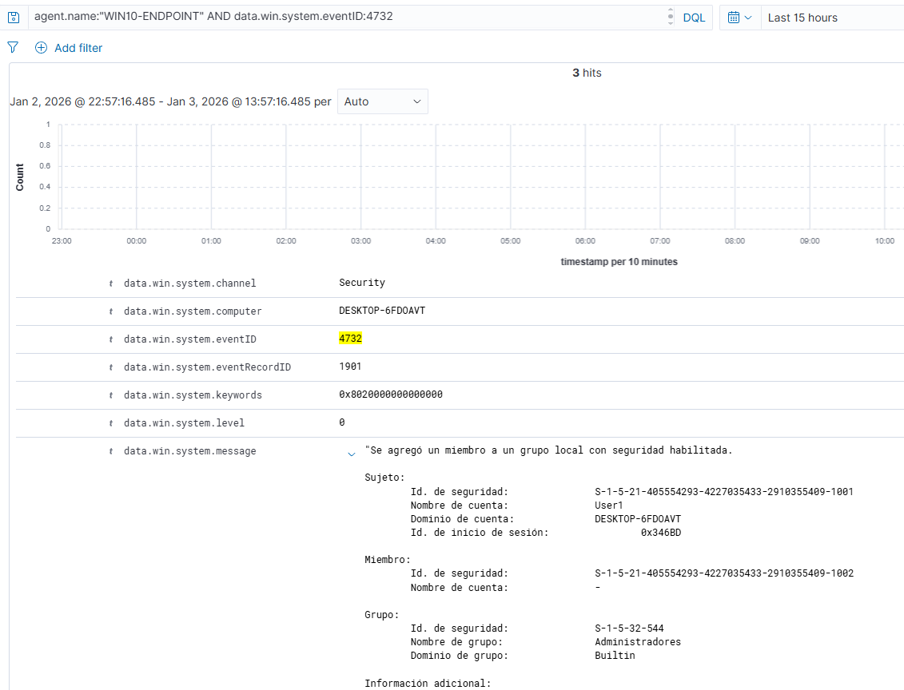

# Case 01 — Local User Creation & Privilege Escalation

## Summary
A local user account was created and later added to the local Administrators group on a Windows endpoint monitored by Wazuh.

## Endpoint Information
- Hostname: WIN10-ENDPOINT
- IP address: 192.168.56.103
- Operating System: Windows 10 Pro

## Detection
The following Windows Security Events were detected by Wazuh:

- EventID 4720 — User account created
- EventID 4732 — User added to Administrators group

## Queries used
agent.name:"WIN10-ENDPOINT" AND data.win.system.eventID:4720

agent.name:"WIN10-ENDPOINT" AND data.win.system.eventID:4732

## Analysis (SOC Triage)
This activity could indicate persistence or privilege escalation if it was not authorized.
The creation of a new local user followed by administrative privileges requires validation.

## Severity
Medium

## Recommendations
- Validate whether the user creation was authorized.
- Disable the account if the activity is suspicious.
- Review the user that performed the action (subject user).
- Monitor related authentication events.

## Evidence
Screenshots of the detected events and the active agent are included in this folder.
## Screenshots

### Agent Active

### EventID 4720 — User Created

### EventID 4732 — Added to Administrators

