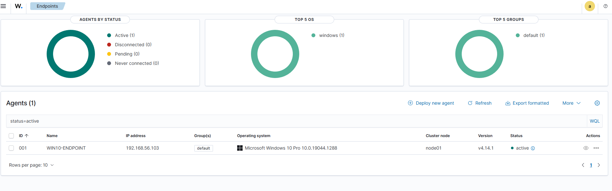
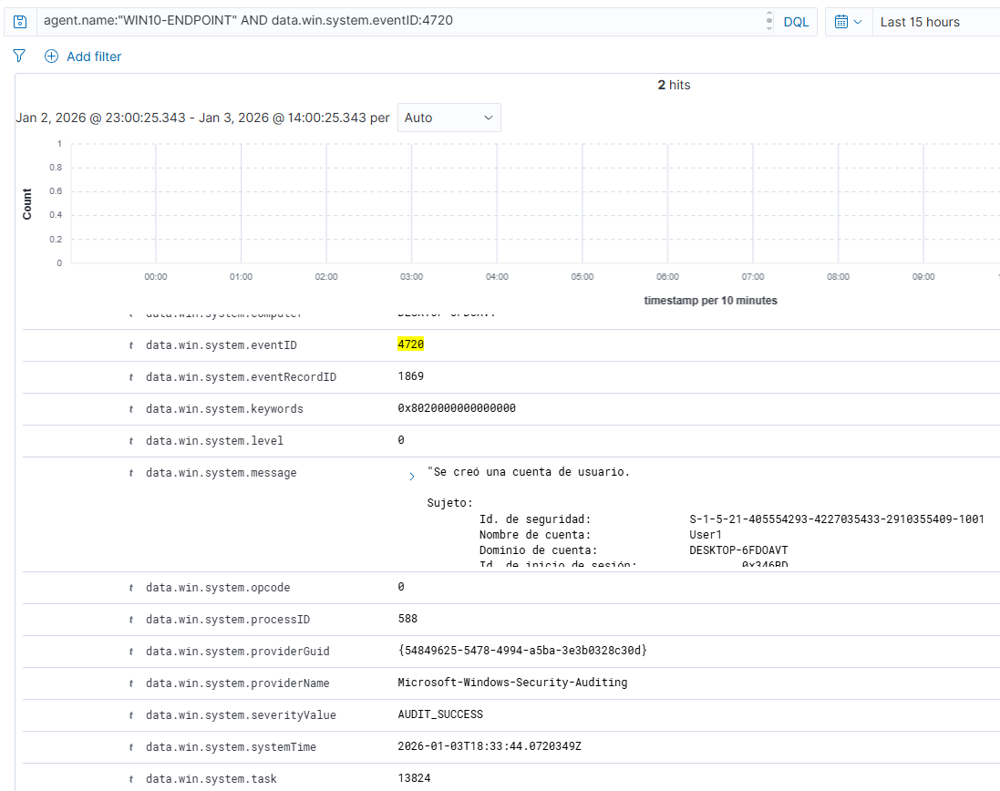
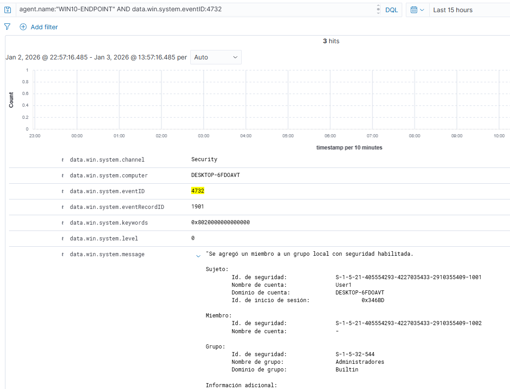

# Case 01 — Local User Creation & Privilege Escalation (Windows)

## Summary

This detection case documents the creation of a new local user account on a Windows endpoint, followed by the addition of that account to the local **Administrators** group.

This behavior may indicate **privilege escalation** or **persistence**, especially during post-compromise activity if the change was not properly authorized.

The endpoint is monitored using **Wazuh**, with detection based on **native Windows Security Event Logs**.

---

## Threat Hypothesis

An attacker or unauthorized user may create a new local account and assign it administrative privileges in order to establish persistence or elevate privileges on the host.

This activity is also relevant from a SOC perspective because it can represent:

- unauthorized local account provisioning
- abuse of administrative privileges
- suspicious post-compromise account manipulation
- preparation for later interactive or remote access

---

## ATT&CK Mapping

| Tactic | Technique | ID |
|--------|-----------|----|
| Persistence | Create Account: Local Account | T1136.001 |
| Privilege Escalation | Account Manipulation | T1098 |
| Privilege Escalation | Privilege Escalation | TA0004 |
| Persistence | Persistence | TA0003 |

---

## Telemetry Required

- **Log source:** Windows Security Event Log
- **Collection method:** Wazuh Agent via Windows Event Channel
- **Relevant Event IDs:**
  - **4720** — A local user account was created
  - **4732** — A member was added to a security-enabled local group
- **Key fields observed:**
  - `SubjectUserName`
  - `TargetUserName`
  - `TargetDomainName`
  - `ComputerName`
  - `Timestamp`

These fields help determine:

- who performed the action
- which account was affected
- where the activity occurred
- when the activity took place

---

## Lab Setup

- **SIEM:** Wazuh
- **Endpoint:** Windows 10 Pro
- **Hostname:** WIN10-ENDPOINT
- **IP Address:** 192.168.56.103
- **Operating System:** Windows 10 Pro

---

## Simulation Steps

This activity was executed in a controlled lab environment for **educational and testing purposes only**.

### Actions Performed

1. A new local user account was created.
2. The account was added to the local **Administrators** group.

### Expected Outcome

The endpoint should generate:

- **Event ID 4720** for local user account creation
- **Event ID 4732** for membership assignment to a privileged local group

These events should be ingested and searchable in Wazuh.

---

## Log Validation

Telemetry was validated by confirming that the expected Windows Security Events were present in Wazuh after the simulated activity.

### Validation Questions

- Did Event ID **4720** appear after account creation?
- Did Event ID **4732** appear after group membership assignment?
- Was the correct endpoint identified in the logs?
- Were the relevant user-related fields available for analyst review?

### Validation Result

Both expected events were successfully detected by Wazuh on the monitored Windows endpoint, confirming that native Windows Security logging was sufficient for this detection case.

---

## Detection Logic

This case focuses on identifying a suspicious sequence of account-related administrative activity:

- creation of a new local account
- assignment of that account to the local **Administrators** group

Either event may be useful on its own, but together they provide stronger context for possible privilege escalation or persistence.

---

## Detection Content

### Observed Security Events

- **EventID 4720** — A local user account was created
- **EventID 4732** — A user was added to a security-enabled local group (**Administrators**)

---

## Hunt Queries

### Account Creation

```text
agent.name:"WIN10-ENDPOINT" AND data.win.system.eventID:4720
```

### Added to Administrators

```text
agent.name:"WIN10-ENDPOINT" AND data.win.system.eventID:4732
```

### Why These Queries Were Useful

These queries were used to confirm that:

- the correct endpoint generated the expected events
- the simulated activity was ingested successfully
- the relevant privilege-related actions were available for analyst investigation

---

## Alert Validation

The case was validated by executing the simulated administrative actions and confirming that the corresponding Windows Security Events were visible in Wazuh.

### Validation Checklist

- [x] Activity executed in the lab
- [x] Relevant logs ingested
- [x] Event ID 4720 observed
- [x] Event ID 4732 observed
- [x] Relevant fields available for triage
- [x] Evidence captured with screenshots

---

## Investigation / Triage Notes

This activity could indicate **privilege escalation** or **persistence** if not authorized.

### Initial Triage Questions

- Is the **subject user** part of IT, Helpdesk, or an approved admin team?
- Was the action performed during expected business or maintenance hours?
- Was the account creation followed by successful logons (**Event ID 4624**)?
- Was the action performed locally or through remote access?
- Does the username match organizational naming conventions?
- Has similar local account creation occurred on other endpoints?

### Analyst Assessment

Local account creation followed by administrative group assignment is a high-value SOC detection because it may represent an attempt to maintain access or escalate privileges after initial compromise.

In a real environment, this alert should be reviewed carefully for context, change approval, user legitimacy, and follow-on activity.

---

## Severity

- **Severity:** Medium

### Severity Rationale

Local user creation and assignment to the Administrators group can be legitimate in some environments, particularly during approved administrative maintenance.

Severity should be escalated to **High** if any of the following are observed:

- performed by a non-IT or unexpected user
- executed outside normal business hours
- followed by suspicious authentication activity
- observed across multiple endpoints
- associated with remote access or persistence-related behavior

---

## False Positives

Potential benign explanations include:

- IT administrators provisioning local accounts
- break-glass or emergency administrative accounts
- authorized maintenance or troubleshooting activity
- endpoint setup or imaging processes

---

## Tuning Opportunities

To improve detection quality and reduce false positives, the following tuning steps are recommended:

- allowlist known IT and administrative accounts
- alert only when the subject user is not part of approved admin groups
- correlate with remote logon activity such as **RDP**, **SMB**, or **WinRM**
- increase severity when combined with persistence or suspicious PowerShell execution
- monitor for first logon activity by the newly created account

---

## Containment / Remediation

If the activity appears suspicious:

- validate whether the account creation was authorized
- disable or remove the new account if unauthorized
- remove the account from privileged groups if necessary
- review authentication activity associated with the account
- search for similar activity across other systems
- investigate adjacent events around the same timestamp

---

## Lessons Learned

This case reinforces several important detection engineering and SOC analysis concepts:

- native Windows Security logs can provide useful detection value even without Sysmon or EDR
- local account creation combined with privileged group membership is a strong analyst triage signal
- context is critical when deciding whether the activity is legitimate administration or suspicious escalation
- documenting the investigation process improves reproducibility and makes the case stronger as portfolio material

---

## Evidence

Screenshots of the detected events and the active agent are included in this folder.

---

## Screenshots

### Agent Active


### EventID 4720 — User Created


### EventID 4732 — Added to Administrators


---

## Reproduction Status

- [x] Reproducible in current lab
- [x] Detection validated
- [x] Query validated
- [x] Triage documented
- [x] Evidence attached

