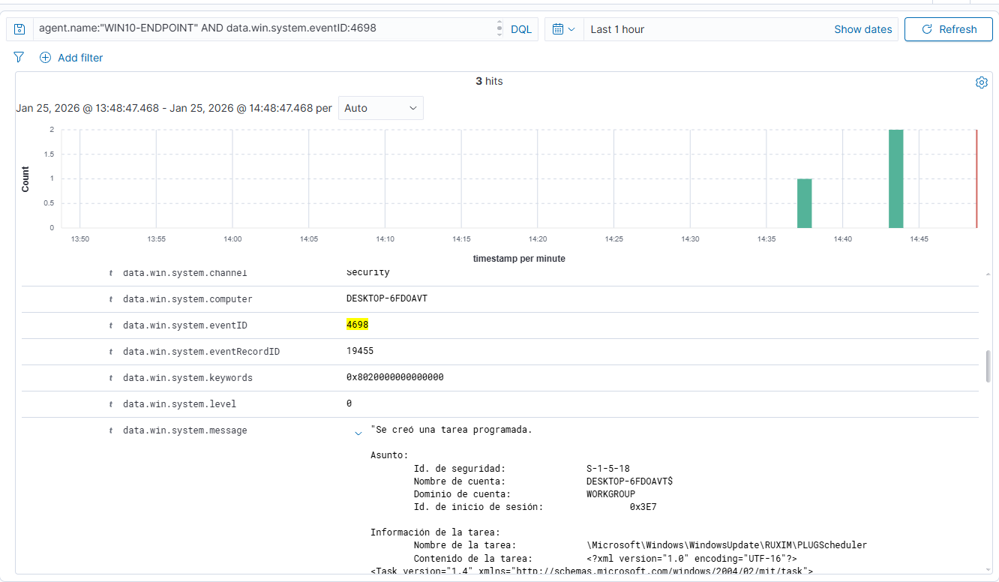
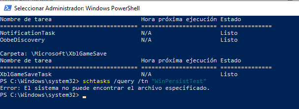

# Case 02 — Persistence via Scheduled Task

## Summary
A scheduled task was created on a Windows endpoint monitored by Wazuh, representing a potential persistence mechanism commonly abused by attackers.

## Endpoint Information
- Hostname: WIN10-ENDPOINT
- IP address: 192.168.56.103
- Operating System: Windows 10 Pro

## Detection
The following Windows Security Event was detected by Wazuh:

- EventID 4698 — Scheduled task created

## Queries used
agent.name:"WIN10-ENDPOINT" AND data.win.system.eventID:4698

## Analysis (SOC Triage)
Scheduled tasks are frequently abused to maintain persistence by executing commands at intervals or on logon/startup. Any new scheduled task should be validated for legitimacy, owner, trigger frequency, and executed command.

## Severity
Medium (could be High in production if unauthorized)

## Response
The scheduled task was removed after detection.

## Verification
Remediation was verified directly on the endpoint using the following command:

schtasks /query /tn "WinPersistTest"

The system returned that the task does not exist, confirming successful removal.

## Evidence
Screenshots of the detected event and remediation verification are included in this folder.

## Screenshots

### EventID 4698 — Scheduled Task Created

### Remediation Verification — schtasks /query

