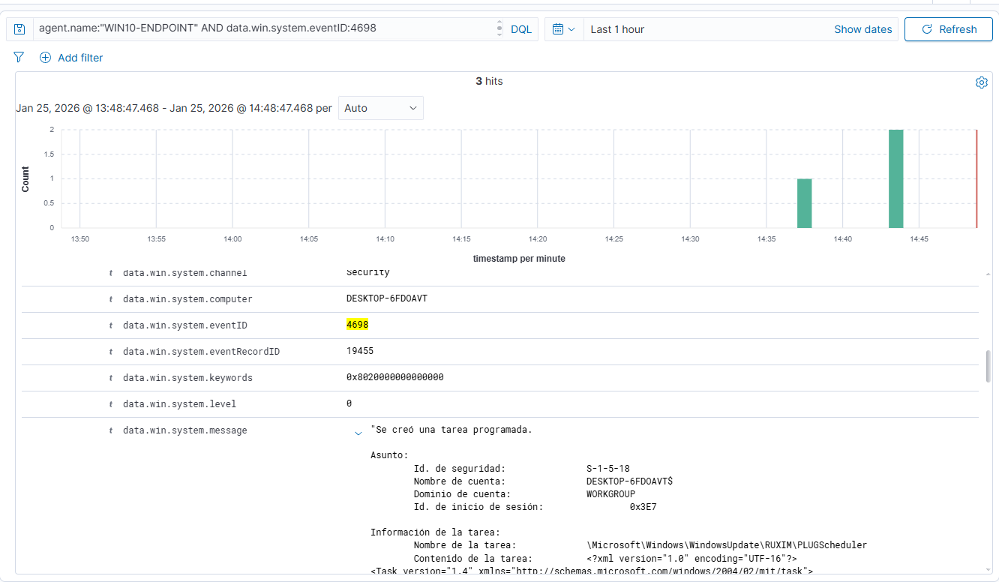
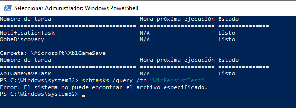

# Case 02 — Persistence via Scheduled Task (Windows)

## Summary

This detection case documents the creation of a scheduled task on a Windows endpoint monitored by **Wazuh**.

Scheduled tasks are a commonly abused **persistence mechanism** because they allow commands, scripts, or binaries to execute automatically at logon, startup, or at defined intervals.

From a SOC perspective, this activity must be validated carefully to distinguish between **legitimate administrative automation** and **malicious persistence**.

---

## Threat Hypothesis

An attacker or unauthorized user may create a scheduled task in order to maintain persistence on the endpoint, automatically execute malicious code, or re-establish access after logon or system restart.

This activity is relevant because scheduled tasks are often used to:

- execute scripts or payloads automatically
- maintain access after reboot
- blend in with legitimate administrative activity
- establish recurring execution without user interaction

---

## ATT&CK Mapping

| Tactic | Technique | ID |
|--------|-----------|----|
| Persistence | Scheduled Task / Job: Scheduled Task | T1053.005 |
| Persistence | Persistence | TA0003 |

---

## Telemetry Required

- **Log source:** Windows Security Event Log
- **Collection method:** Wazuh Agent via Windows Event Channel
- **Relevant Event ID:**
  - **4698** — A scheduled task was created
- **Key fields observed:**
  - `SubjectUserName`
  - `TaskName`
  - `TaskContent`
  - `RunAsUser`
  - `ComputerName`
  - `Timestamp`

These fields help determine:

- who created the task
- what command or script it executes
- whether it runs with elevated privileges
- where and when the activity occurred

---

## Lab Setup

- **SIEM:** Wazuh
- **Endpoint:** Windows 10 Pro
- **Hostname:** WIN10-ENDPOINT
- **IP Address:** 192.168.56.103
- **Operating System:** Windows 10 Pro

---

## Simulation Steps

This activity was executed in a controlled lab environment for **educational and testing purposes only**.

### Actions Performed

1. A scheduled task was created on the Windows endpoint.
2. The task was configured to execute automatically.

### Expected Outcome

The endpoint should generate:

- **Event ID 4698** for scheduled task creation

The event should be ingested and searchable in Wazuh, allowing review of the task name, creator account, and execution details.

---

## Log Validation

Telemetry was validated by confirming that the expected scheduled task creation event appeared in Wazuh after the simulated action.

### Validation Questions

- Did Event ID **4698** appear after task creation?
- Was the event associated with the correct endpoint?
- Were the relevant fields available for analyst review?
- Did the event provide enough context to understand the task’s purpose and execution details?

### Validation Result

The expected scheduled task creation event was successfully observed in Wazuh, confirming that native Windows Security logging provided sufficient visibility for this persistence-related use case.

---

## Detection Logic

This case focuses on identifying the creation of a new scheduled task, which may represent legitimate automation or suspicious persistence depending on context.

The detection becomes more valuable when analysts review:

- the task name
- the command or script executed
- the account that created the task
- the user context under which the task runs

---

## Detection Content

### Observed Security Event

- **EventID 4698** — A scheduled task was created

---

## Hunt Query

```text
agent.name:"WIN10-ENDPOINT" AND data.win.system.eventID:4698
```

### Why This Query Was Useful

This query was used to confirm that:

- the expected persistence-related activity occurred on the target endpoint
- Wazuh ingested the relevant event successfully
- the event contained enough context for triage and validation

---

## Alert Validation

The case was validated by creating the scheduled task in the lab and confirming that the corresponding Windows Security Event was visible in Wazuh.

### Validation Checklist

- [x] Activity executed in the lab
- [x] Relevant log ingested
- [x] Event ID 4698 observed
- [x] Relevant task fields available for review
- [x] Evidence captured with screenshots

---

## Investigation / Triage Notes

Scheduled tasks are frequently abused by attackers to maintain persistence or automate malicious execution.

### Initial Triage Questions

- Is the **subject user** part of IT or system administrators?
- Does the **task name** appear legitimate or suspicious?
- What command, script, or binary does the task execute?
- How often does the task run?
- Does it execute at startup, logon, or another important trigger point?
- Does the task run with elevated privileges?
- Is the same task present on other endpoints?
- Was the task created shortly after other suspicious activity?

### Analyst Assessment

Scheduled task creation is a valuable SOC detection because it can indicate an attempt to persist on the system or automate follow-on activity.

The task should be evaluated in context. Legitimate administrative automation is common, but suspicious task names, abnormal execution paths, or unexpected creator accounts can raise confidence that the activity is malicious.

---

## Severity

- **Severity:** Medium

### Severity Rationale

Scheduled task creation may be legitimate in many environments, especially for maintenance, automation, monitoring, or backup operations.

Severity should be escalated to **High** if any of the following are observed:

- created by a non-IT or unexpected account
- executes suspicious commands or scripts
- runs from user-writable directories
- uses elevated privileges
- persists across startup or user logon
- is associated with other suspicious activity on the same host

---

## False Positives

Potential benign explanations include:

- IT automation tasks
- maintenance or patching workflows
- system monitoring scripts
- backup or administrative jobs
- legitimate software installer tasks

---

## Tuning Opportunities

To improve detection quality and reduce noise, the following tuning steps are recommended:

- allowlist known administrative task names and approved paths
- alert when tasks execute binaries from user-writable directories
- review suspicious task names that do not match organizational naming conventions
- correlate with suspicious process execution or network activity
- increase severity when combined with other persistence indicators

---

## Containment / Remediation

Upon detection in the lab, the scheduled task was removed from the endpoint.

If similar activity were suspicious in a real environment, the following actions would be appropriate:

- validate whether the task creation was authorized
- disable or delete the task if unauthorized
- inspect the referenced command, script, or binary
- review recent process execution and authentication activity on the host
- search for the same task or execution pattern across other endpoints

---

## Verification

Remediation was verified directly on the endpoint using the following command:

```text
schtasks /query /tn "WinPersistTest"
```

The system returned that the task does not exist, confirming successful removal.

---

## Lessons Learned

This case reinforces several important SOC and detection engineering concepts:

- scheduled task creation is a valuable persistence signal even when using only native Windows logs
- context is essential when separating legitimate automation from malicious persistence
- reviewing task name, command content, and creator account improves triage quality
- remediation should be validated directly on the endpoint when possible

---

## Evidence

Screenshots of the detected event and remediation verification are included in this folder.

---

## Screenshots

### EventID 4698 — Scheduled Task Created


### Remediation Verification — schtasks /query


---

## Reproduction Status

- [x] Reproducible in current lab
- [x] Detection validated
- [x] Query validated
- [x] Triage documented
- [x] Evidence attached
