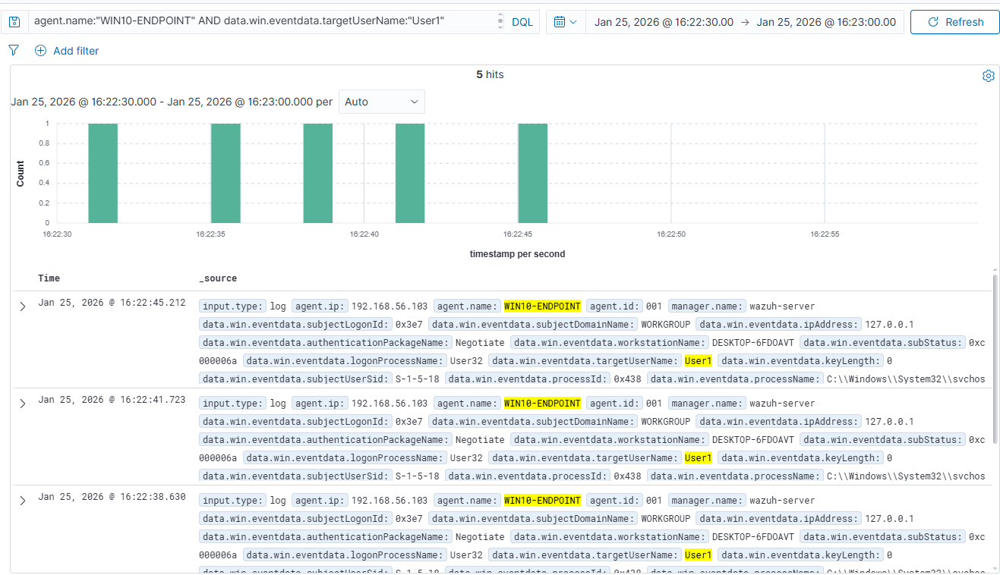
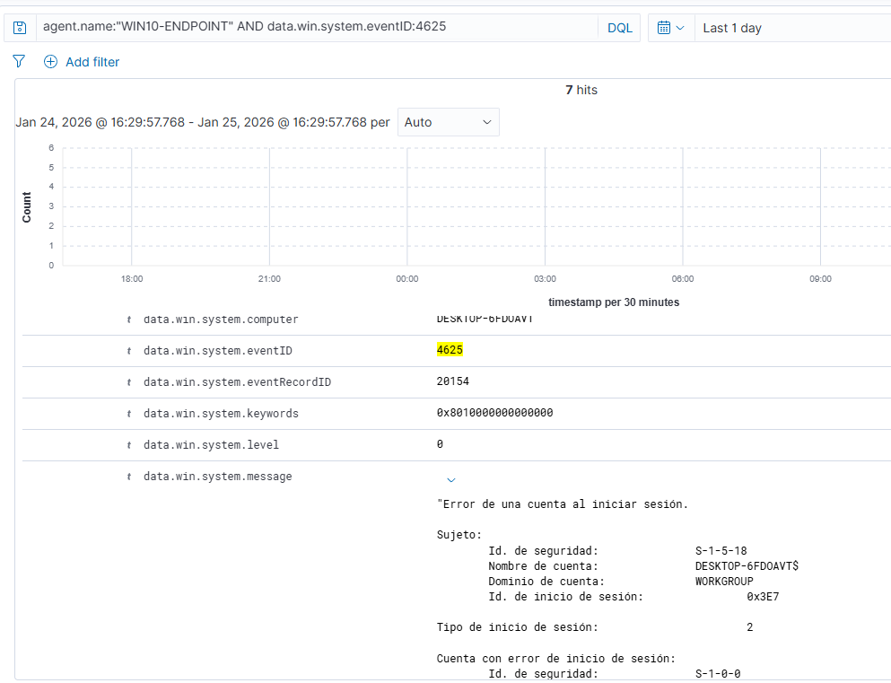
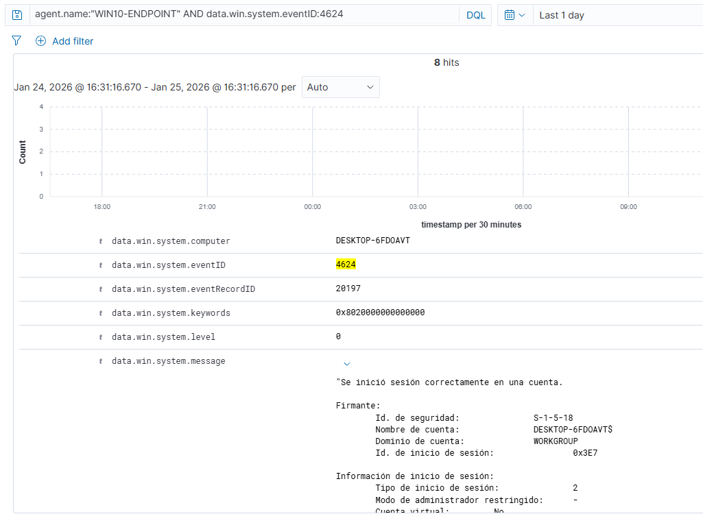

# Case 03 — Failed Logons / Brute Force

## Summary
Multiple failed authentication attempts followed by a successful login were detected on a Windows endpoint monitored by Wazuh, indicating a potential brute force attack.

## Endpoint Information
- Hostname: WIN10-ENDPOINT
- IP address: 192.168.56.103
- Operating System: Windows 10 Pro

## Detection
The following Windows Security Events were detected by Wazuh:

- EventID 4625 — Failed logon
- EventID 4624 — Successful logon

## Queries used
agent.name:"WIN10-ENDPOINT" AND data.win.system.eventID:4625

agent.name:"WIN10-ENDPOINT" AND data.win.system.eventID:4624

## Analysis (SOC Triage)
Multiple failed authentication attempts against the account `User1` in a short time window, followed by a successful login, indicate a potential brute force or password guessing attack. This activity requires immediate validation and response.

## MITRE ATT&CK
- T1110 — Brute Force

## Severity
High

## Recommendations
- Enforce account lockout policies.
- Enable Multi-Factor Authentication (MFA).
- Monitor repeated authentication failures.
- Investigate the source of the login attempts.

## Evidence
Screenshots showing multiple failed logons and the subsequent successful authentication are included in this folder.

## Screenshots

### Failed Logons — EventID 4625 (Timeline)

### Failed Logon — EventID 4625 (Detail)

### Successful Logon — EventID 4624

