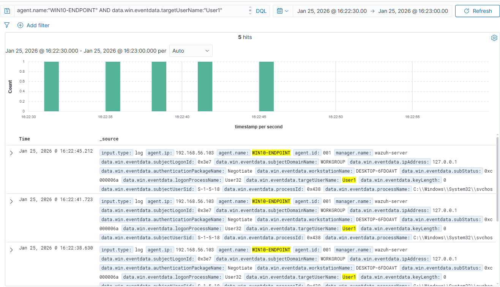
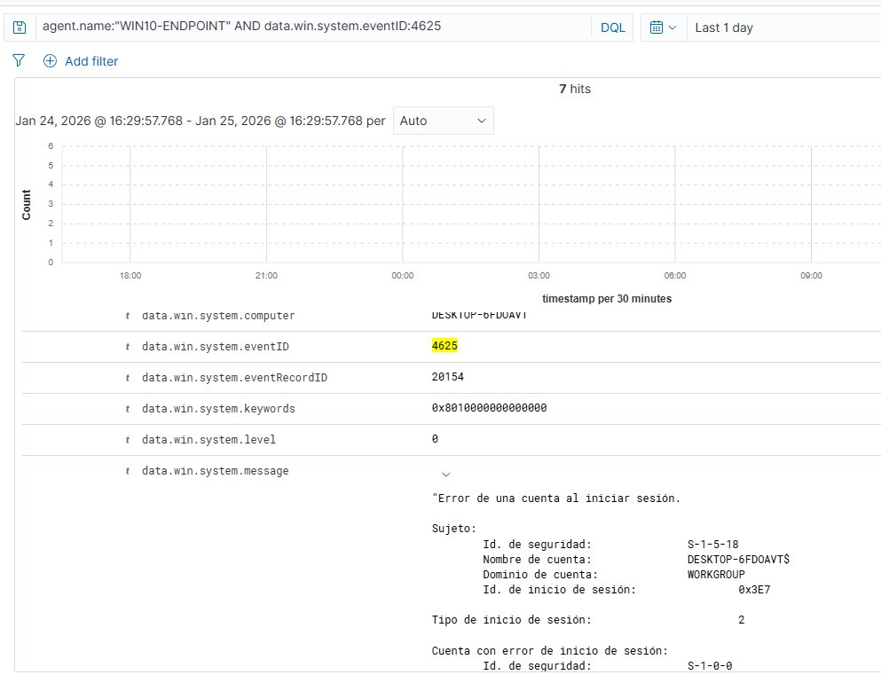
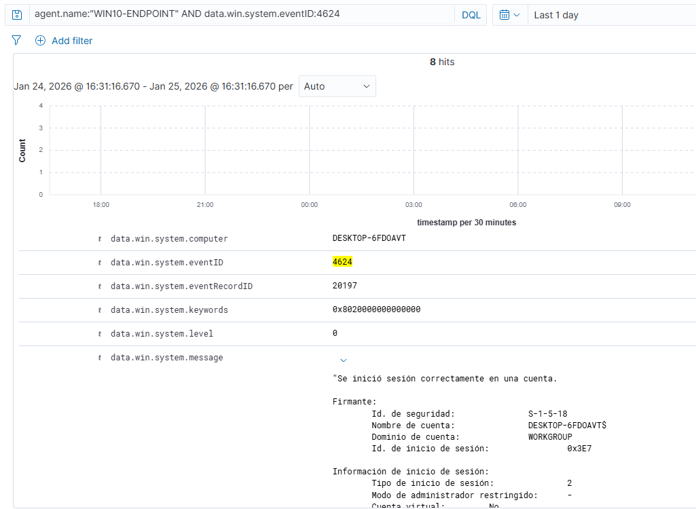

# Case 03 — Failed Logons / Brute Force (Windows)

## Summary

This detection case documents multiple failed authentication attempts followed by a successful logon on a Windows endpoint monitored by **Wazuh**.

This pattern is commonly associated with **brute force** or **password guessing attacks**, where an attacker attempts multiple credentials until valid access is obtained.

From a SOC perspective, this activity should be investigated carefully to determine whether it reflects normal user error, misconfigured credentials, or a real **credential-based attack**.

---

## Threat Hypothesis

An attacker or unauthorized user may attempt repeated password guesses against a local or domain account until a valid authentication succeeds.

This behavior is important because it may indicate:

- password guessing against a valid user account
- brute force activity from a local or remote source
- eventual account compromise after repeated failures
- preparation for lateral movement or privilege escalation

---

## ATT&CK Mapping

| Tactic | Technique | ID |
|--------|-----------|----|
| Credential Access | Brute Force | T1110 |
| Credential Access | Credential Access | TA0006 |
| Initial Access | Initial Access | TA0001 |

---

## Telemetry Required

- **Log source:** Windows Security Event Log
- **Collection method:** Wazuh Agent via Windows Event Channel
- **Relevant Event IDs:**
  - **4625** — Failed logon attempt
  - **4624** — Successful logon
- **Key fields observed:**
  - `TargetUserName`
  - `LogonType`
  - `IpAddress`
  - `WorkstationName`
  - `FailureReason`
  - `ComputerName`
  - `Timestamp`

These fields help determine:

- which account was targeted
- how many failed attempts occurred
- whether the successful logon followed the failures
- where the activity originated
- what type of authentication was used

---

## Lab Setup

- **SIEM:** Wazuh
- **Endpoint:** Windows 10 Pro
- **Hostname:** WIN10-ENDPOINT
- **IP Address:** 192.168.56.103
- **Operating System:** Windows 10 Pro

---

## Simulation Steps

This activity was executed in a controlled lab environment for **educational and testing purposes only**.

### Actions Performed

1. Multiple failed logon attempts were generated against a user account.
2. A successful authentication occurred after the repeated failures.

### Expected Outcome

The endpoint should generate:

- **Event ID 4625** for each failed logon attempt
- **Event ID 4624** for the successful logon

These events should be visible in Wazuh and provide enough context to support analyst correlation and triage.

---

## Log Validation

Telemetry was validated by confirming that repeated failed authentication events were present in Wazuh and that a successful logon event occurred afterward.

### Validation Questions

- Did Event ID **4625** appear for each failed authentication attempt?
- Did Event ID **4624** appear after the failed attempts?
- Were the targeted username and source details visible?
- Was there enough context to correlate the authentication sequence?

### Validation Result

The expected authentication events were successfully observed in Wazuh. Multiple failed logons were recorded, followed by a successful logon, confirming that native Windows Security logging provided sufficient visibility for this brute force detection scenario.

---

## Detection Logic

This case focuses on identifying a suspicious authentication pattern:

- repeated failed logon attempts
- followed by a successful authentication

A single failed logon is usually low value by itself. However, repeated failures in a short period of time, especially when followed by a successful logon for the same account, can indicate brute force or password guessing activity.

---

## Detection Content

### Observed Security Events

- **EventID 4625** — Failed logon attempt
- **EventID 4624** — Successful logon

---

## Hunt Queries

### Failed Logons

```text
agent.name:"WIN10-ENDPOINT" AND data.win.system.eventID:4625
```

### Successful Logons

```text
agent.name:"WIN10-ENDPOINT" AND data.win.system.eventID:4624
```

### Why These Queries Were Useful

These queries were used to confirm that:

- repeated failed logon attempts occurred on the endpoint
- a successful authentication followed the failures
- the account, logon type, and source details were available for review
- the sequence could be investigated as a possible credential attack pattern

---

## Alert Validation

The case was validated by generating multiple failed logon attempts in the lab and confirming that the relevant Windows Security Events were visible in Wazuh.

### Validation Checklist

- [x] Activity executed in the lab
- [x] Relevant logs ingested
- [x] Event ID 4625 observed
- [x] Event ID 4624 observed
- [x] Authentication context available for triage
- [x] Evidence captured with screenshots

---

## Investigation / Triage Notes

Multiple failed authentication attempts against the account `User1` in a short time window, followed by a successful logon, indicate a **potential brute force attack**.

### Initial Triage Questions

- How many failed attempts occurred and within what timeframe?
- Did the successful logon originate from the same **IP address** or **workstation**?
- What **logon type** was used?
- Is the targeted account privileged, sensitive, or commonly targeted?
- Is similar activity observed on other endpoints or accounts?
- Did the successful logon lead to further suspicious activity?
- Was there any password reset or known user error around the same time?

### Analyst Assessment

A successful logon following repeated failures is a high-value SOC signal because it may indicate valid credentials were guessed or obtained after multiple attempts.

This pattern should be investigated quickly to determine whether the activity reflects simple user error, service misconfiguration, or a real account compromise with risk of lateral movement or privilege escalation.

---

## Severity

- **Severity:** High

### Severity Rationale

A successful logon following repeated failed attempts significantly increases the likelihood that the activity represents credential abuse rather than isolated user error.

Immediate investigation is recommended to confirm whether the account has been compromised and whether the successful session resulted in additional malicious activity.

---

## False Positives

Potential benign explanations include:

- users repeatedly mistyping passwords
- cached credentials after password changes
- service accounts with outdated or misconfigured credentials
- application retries using invalid credentials
- logon attempts during troubleshooting or maintenance

---

## Tuning Opportunities

To improve detection quality and reduce noise, the following tuning steps are recommended:

- alert only when failures exceed a defined threshold within a short time window
- correlate failed and successful logons by **username** and **source IP**
- exclude known service accounts where appropriate
- review logon type to separate interactive use from background authentication noise
- increase severity when followed by privileged actions, remote logons, or suspicious process execution

---

## Containment / Remediation

If the activity appears suspicious:

- reset the affected account password immediately
- investigate the source IP or workstation involved
- review logon history for the account across the environment
- enforce or validate account lockout policies
- require **Multi-Factor Authentication (MFA)** where possible
- monitor for lateral movement, privilege escalation, or persistence after the successful logon

---

## Lessons Learned

This case reinforces several important SOC and detection engineering concepts:

- authentication telemetry can provide strong detection value even without Sysmon or EDR
- repeated failed logons become much more meaningful when correlated with a later successful authentication
- context such as source IP, logon type, and targeted account is essential for triage
- brute force detection benefits greatly from thresholding and correlation logic

---

## Evidence

Screenshots showing multiple failed logons and the subsequent successful authentication are included in this folder.

---

## Screenshots

### Failed Logons — EventID 4625 (Timeline)


### Failed Logon — EventID 4625 (Detail)


### Successful Logon — EventID 4624


---

## Reproduction Status

- [x] Reproducible in current lab
- [x] Detection validated
- [x] Query validated
- [x] Triage documented
- [x] Evidence attached
