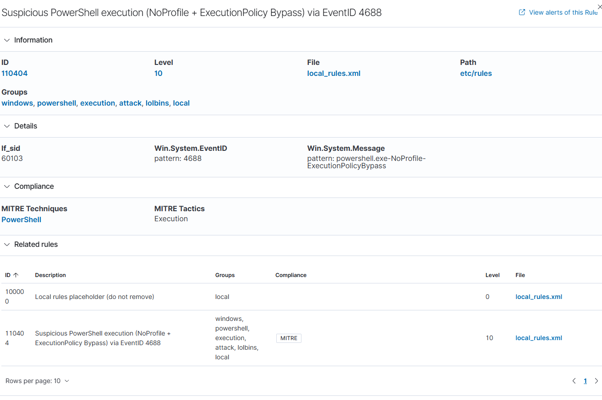
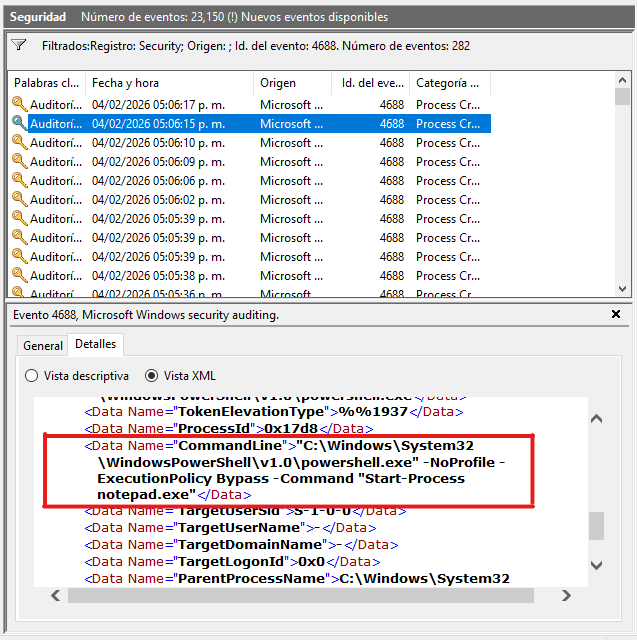

# Case 04 — Suspicious PowerShell Execution (LOLBins)

## Summary
A suspicious PowerShell execution was detected on a Windows endpoint monitored by Wazuh.
The execution leveraged common evasion flags such as `-NoProfile` and `-ExecutionPolicy Bypass`, which are frequently abused by attackers to bypass security controls and execute malicious payloads.

This case documents not only the detection itself, but also the full analyst workflow required to successfully build a stable custom detection rule in a real-world Wazuh environment without Sysmon.

---

## Environment
- SIEM: Wazuh 4.14.1 (OVA)
- Endpoint OS: Windows 10
- Log source: Windows Security Event Log
- Collection method: Windows Event Channel (WEF)
- Event ID: 4688 (Process Creation)
- Agent: WIN10-ENDPOINT

---

## Initial Challenge
The PowerShell execution was visible in Windows Event Viewer and in Wazuh Discover, but no custom alert was triggered.
Multiple attempts to create rules based on structured fields resulted in XML syntax errors, manager crashes, or rules that never triggered.

---

## Investigation Timeline

### SSH Access to Wazuh Server
```bash
ssh wazuh-user@wazuh-server
```

### Event Verification on Endpoint
```powershell
powershell.exe -NoProfile -ExecutionPolicy Bypass -Command "Start-Process notepad.exe"
```

### Inspection of alerts.json
```bash
sudo grep -m 1 '"eventID":"4688"' /var/ossec/logs/alerts/alerts.json
```

This revealed that:
- The parent rule uses the `no_full_log` option
- The command line is embedded in `win.system.message`

---

## Root Cause
The base Wazuh rule for EventID 4688 does not store the full structured log, requiring detection via the rendered Windows message instead of structured fields.

---

## Final Detection Rule
```xml
<group name="local,">
  <rule id="100000" level="0">
    <description>Local rules placeholder (do not remove)</description>
  </rule>

  <rule id="110404" level="10">
    <if_sid>60103</if_sid>
    <field name="win.system.eventID">4688</field>
    <field name="win.system.message">powershell.exe</field>
    <field name="win.system.message">-NoProfile</field>
    <field name="win.system.message">-ExecutionPolicy</field>
    <field name="win.system.message">Bypass</field>

    <description>Suspicious PowerShell execution (NoProfile + ExecutionPolicy Bypass) via EventID 4688</description>

    <mitre>
      <id>T1059.001</id>
    </mitre>

    <group>windows,powershell,execution,attack,lolbins,local</group>
  </rule>
</group>
```

---

## MITRE ATT&CK
- T1059.001 – PowerShell
- Tactic: Execution

---

## Severity
High (Level 10)

---

## Outcome
The custom rule successfully triggered, remained stable, and detected the malicious execution scenario as expected.

---

---

### Custom Detection Rule Loaded



### Evidence — Windows Event Log (EventID 4688)

