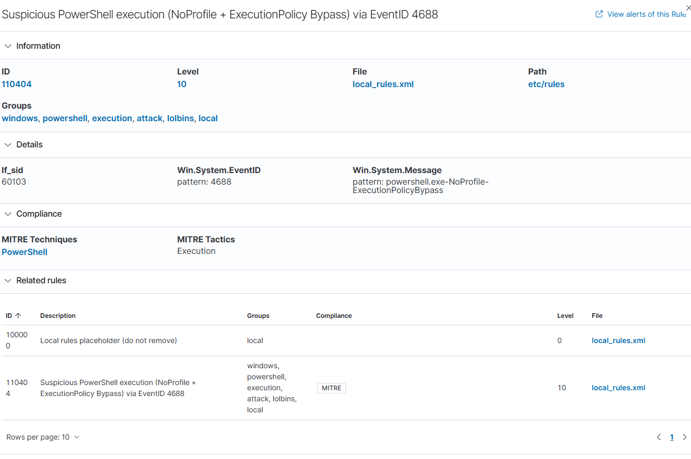
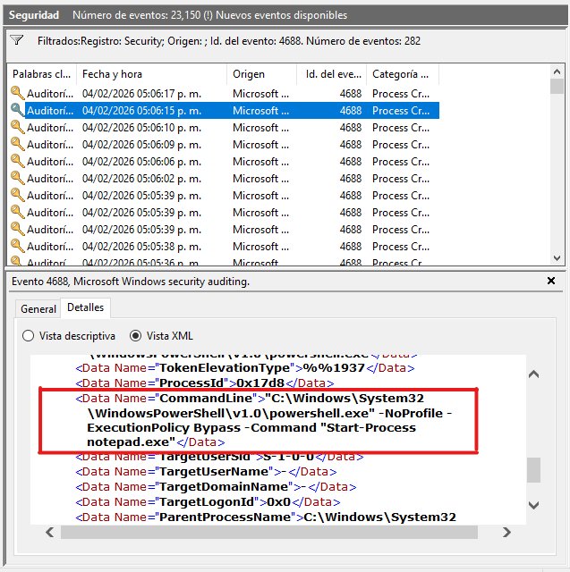

# Case 04 — Suspicious PowerShell Execution (LOLBins)

## Summary

This detection case documents a suspicious PowerShell execution detected on a Windows endpoint monitored by **Wazuh**.

The execution used commonly abused evasion-related arguments such as **`-NoProfile`** and **`-ExecutionPolicy Bypass`**, which are frequently seen in malicious or suspicious PowerShell activity because they reduce user profile loading and weaken normal execution restrictions.

This case is especially valuable because it documents not only the detection itself, but also the full analyst and detection engineering workflow required to build a **stable custom Wazuh rule** in a real-world lab environment **without Sysmon**.

---

## Threat Hypothesis

An attacker or unauthorized user may execute PowerShell with flags designed to reduce visibility, bypass policy restrictions, or launch follow-on commands in a stealthier manner.

This activity is relevant because PowerShell is commonly abused to:

- execute malicious commands or scripts
- download or launch payloads
- bypass standard script execution restrictions
- blend in with administrative tooling as a **LOLBins**-style technique

---

## ATT&CK Mapping

| Tactic | Technique | ID |
|--------|-----------|----|
| Execution | PowerShell | T1059.001 |
| Execution | Execution | TA0002 |

---

## Telemetry Required

- **Log source:** Windows Security Event Log
- **Collection method:** Wazuh Agent via Windows Event Channel
- **Relevant Event ID:**
  - **4688** — A new process has been created
- **Key telemetry observed:**
  - `win.system.eventID`
  - `win.system.message`
  - process creation context rendered inside the Windows event message

### Important Limitation

In this case, the parent Wazuh rule associated with Event ID **4688** uses the **`no_full_log`** option, which means the command-line context was not reliably available as fully parsed structured fields.

As a result, the detection had to be built using the rendered Windows event message stored in:

- `win.system.message`

This became the most important technical finding in the case.

---

## Lab Setup

- **SIEM:** Wazuh 4.14.1 (OVA)
- **Endpoint:** Windows 10
- **Hostname / Agent:** WIN10-ENDPOINT
- **Log source:** Windows Security Event Log
- **Telemetry scope:** Native Windows logs only
- **Additional tooling:** No Sysmon

---

## Simulation Steps

This activity was executed in a controlled lab environment for **educational and testing purposes only**.

### Action Performed

The following command was executed on the Windows endpoint:

```powershell
powershell.exe -NoProfile -ExecutionPolicy Bypass -Command "Start-Process notepad.exe"
```

### Expected Outcome

The endpoint should generate:

- **Event ID 4688** for process creation

The event should include enough detail to identify:

- execution of `powershell.exe`
- use of `-NoProfile`
- use of `-ExecutionPolicy Bypass`

---

## Log Validation

The process execution was first verified on the Windows endpoint and then reviewed in Wazuh to confirm that the underlying event existed before continuing with rule development.

### Validation Questions

- Was Event ID **4688** generated for the PowerShell execution?
- Was the event visible in Wazuh Discover?
- Were the command-line details available as structured fields?
- If not, where was the command content actually stored?

### Validation Result

The PowerShell execution was visible both in Windows Event Viewer and in Wazuh Discover. However, the command-line content was not reliably usable through the expected structured fields.

Inspection of the event data and `alerts.json` showed that the relevant content was embedded inside **`win.system.message`**, which led to a more stable detection approach.

---

## Initial Challenge

Although the suspicious PowerShell execution was visible in the logs, no custom alert was triggered initially.

Multiple rule-writing attempts based on structured field matching resulted in problems such as:

- XML syntax errors
- manager instability or crashes
- rules that loaded successfully but never triggered

This made the case an important example of real-world detection engineering troubleshooting rather than simple alert creation.

---

## Investigation Steps

### SSH Access to Wazuh Server

```bash
ssh wazuh-user@wazuh-server
```

### Event Verification on Endpoint

```powershell
powershell.exe -NoProfile -ExecutionPolicy Bypass -Command "Start-Process notepad.exe"
```

### Inspection of alerts.json

```bash
sudo grep -m 1 '"eventID":"4688"' /var/ossec/logs/alerts/alerts.json
```

### What This Revealed

The investigation showed that:

- the parent rule for Event ID **4688** used **`no_full_log`**
- the command-line content was embedded in **`win.system.message`**
- matching on the rendered event message was more reliable than matching on expected parsed subfields

---

## Root Cause

The base Wazuh handling for Event ID **4688** did not preserve the full process creation context in the way initially expected for structured rule matching.

Because of the **`no_full_log`** behavior, the rule had to be designed around the rendered Windows event message rather than around more granular structured fields.

This was the key reason earlier rule versions failed.

---

## Detection Logic

This case focuses on identifying suspicious PowerShell execution through Event ID **4688** by matching multiple indicators inside the Windows event message:

- `powershell.exe`
- `-NoProfile`
- `-ExecutionPolicy`
- `Bypass`

Individually, some of these values may appear in legitimate administrative activity. Together, they provide a stronger signal for suspicious PowerShell execution worthy of analyst review.

---

## Final Detection Rule

```xml
<group name="local,">
  <rule id="100000" level="0">
    <description>Local rules placeholder (do not remove)</description>
  </rule>

  <rule id="110404" level="10">
    <if_sid>60103</if_sid>
    <field name="win.system.eventID">4688</field>
    <field name="win.system.message">powershell.exe</field>
    <field name="win.system.message">-NoProfile</field>
    <field name="win.system.message">-ExecutionPolicy</field>
    <field name="win.system.message">Bypass</field>

    <description>Suspicious PowerShell execution (NoProfile + ExecutionPolicy Bypass) via EventID 4688</description>

    <mitre>
      <id>T1059.001</id>
    </mitre>

    <group>windows,powershell,execution,attack,lolbins,local</group>
  </rule>
</group>
```

---

## Hunt Query

```text
agent.name:"WIN10-ENDPOINT" AND data.win.system.eventID:4688 AND data.win.system.message:"powershell.exe"
```

### Why This Query Was Useful

This query was used to confirm that:

- the suspicious process creation event was present on the endpoint
- Wazuh ingested the event successfully
- the relevant command-line indicators appeared in the rendered event message
- the message field could be used as a stable detection source

---

## Alert Validation

The case was validated by executing the suspicious PowerShell command in the lab and confirming that the custom rule triggered successfully.

### Validation Checklist

- [x] Activity executed in the lab
- [x] Event ID 4688 observed
- [x] Relevant content identified in `win.system.message`
- [x] Custom rule loaded successfully
- [x] Custom alert triggered
- [x] Evidence captured with screenshots

### Validation Result

The final custom rule successfully triggered, remained stable, and detected the suspicious PowerShell execution scenario as expected.

---

## Investigation / Triage Notes

Suspicious PowerShell execution with **`-NoProfile`** and **`-ExecutionPolicy Bypass`** is a strong signal for analyst review because these arguments are often associated with attempted policy bypass, stealthier execution, or scripted payload delivery.

### Initial Triage Questions

- Was the command executed by an approved administrator or by an unexpected user?
- Was the execution interactive, scripted, or part of another process chain?
- What command or child process followed the PowerShell execution?
- Did the endpoint show other suspicious activity around the same time?
- Was the command launched from a remote session or suspicious parent process?
- Is the same behavior present on other endpoints?

### Analyst Assessment

This detection is high-value because PowerShell remains one of the most abused execution mechanisms in Windows environments. Even without Sysmon, native Windows process creation logs can still support meaningful detections when the analyst understands how the data is actually stored and parsed in Wazuh.

---

## Severity

- **Severity:** High
- **Wazuh Rule Level:** 10

### Severity Rationale

Use of **PowerShell** with evasion-related arguments such as **`-NoProfile`** and **`-ExecutionPolicy Bypass`** is suspicious enough to warrant high-priority analyst review, especially when combined with process creation telemetry and a custom detection rule.

Severity may be increased further if:

- the command launches additional suspicious processes
- the user context is unexpected
- the activity occurs alongside persistence or credential abuse
- the endpoint shows follow-on malicious behavior

---

## False Positives

Potential benign explanations include:

- legitimate administrative troubleshooting
- internal automation scripts
- lab testing or security validation activity
- approved software management workflows using PowerShell

---

## Tuning Opportunities

To improve detection quality and reduce noise, the following tuning steps are recommended:

- exclude known administrative scripts where appropriate
- review the parent process if available
- raise severity when PowerShell spawns suspicious child processes
- correlate with network activity, persistence events, or account changes
- compare common administrative execution patterns to suspicious outliers

---

## Containment / Remediation

If the activity appears suspicious in a real environment:

- validate whether the PowerShell execution was authorized
- identify the user and execution context
- review related process creation events around the same timestamp
- inspect follow-on activity such as persistence, downloads, or remote access
- isolate the endpoint if broader malicious behavior is confirmed
- search for similar PowerShell execution patterns across the environment

---

## Lessons Learned

This case reinforces several important SOC and detection engineering concepts:

- visibility in the SIEM does not guarantee that a custom rule will trigger
- understanding how Wazuh stores and parses event content is critical
- `no_full_log` can significantly change rule design strategy
- stable detections often come from using the data that is actually present, not the data you expected to have
- detection engineering includes debugging, validation, and operational stability

---

## Evidence

### Custom Detection Rule Loaded


### Evidence — Windows Event Log (EventID 4688)


---

## Reproduction Status

- [x] Reproducible in current lab
- [x] Detection validated
- [x] Query validated
- [x] Triage documented
- [x] Evidence attached
