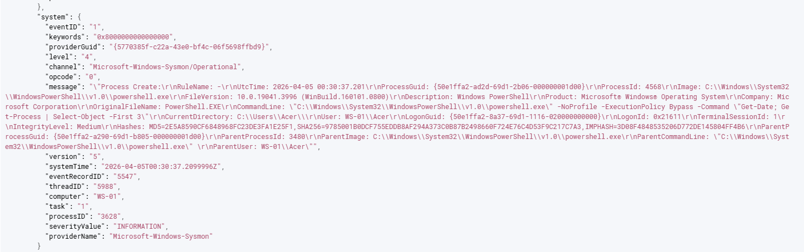
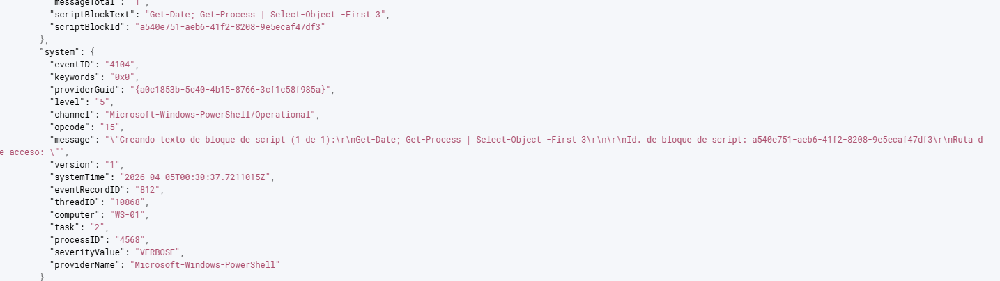
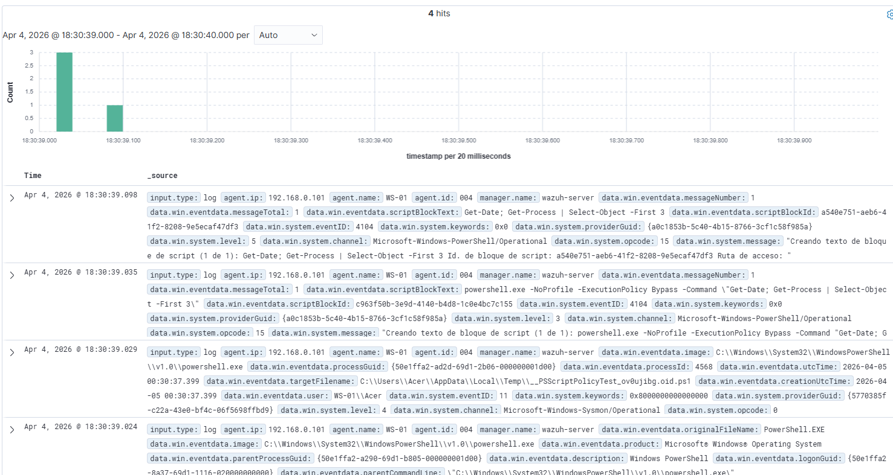

# Case 05 — PowerShell Execution Correlated with Sysmon and Script Block Logging

## Summary

This detection case documents a suspicious-looking PowerShell execution observed on a Windows endpoint monitored by **Wazuh**, using enriched telemetry from both **Sysmon** and **PowerShell Script Block Logging**.

The execution used commonly reviewed PowerShell arguments such as **`-NoProfile`** and **`-ExecutionPolicy Bypass`**, which are frequently associated with suspicious or defense-evasion-related command execution.

This case is especially valuable because it demonstrates how a SOC analyst can correlate two different telemetry sources to understand the same activity from different perspectives:

- **Sysmon Event ID 1** confirms that a new PowerShell process was created.
- **PowerShell Event ID 4104** shows the actual script block content executed inside PowerShell.

Unlike the previous case based on native Windows process creation logs, this case focuses on **telemetry correlation** rather than on building a custom rule.

---

## Threat Hypothesis

An attacker or unauthorized user may execute PowerShell with flags designed to reduce visibility, bypass execution controls, or launch follow-on commands in a stealthier way.

This activity is relevant because PowerShell is commonly abused to:

- execute malicious commands or scripts
- bypass standard execution restrictions
- blend in with legitimate administrative tooling
- perform follow-on actions using built-in Windows functionality
- support hands-on-keyboard activity without dropping external tools

This case focuses on how enriched endpoint telemetry improves investigation quality and reduces ambiguity during triage.

---

## ATT&CK Mapping

| Tactic | Technique | ID |
|--------|-----------|----|
| Execution | PowerShell | T1059.001 |
| Execution | Command and Scripting Interpreter | T1059 |
| Execution | Execution | TA0002 |

---

## Telemetry Required

- **Log source 1:** Microsoft-Windows-Sysmon/Operational
- **Log source 2:** Microsoft-Windows-PowerShell/Operational
- **Collection method:** Wazuh Agent via Windows Event Channel

### Relevant Event IDs

- **Sysmon Event ID 1** — Process Create
- **PowerShell Event ID 4104** — Script Block Logging

### Key Telemetry Observed

#### Sysmon
- `data.win.system.providerName`
- `data.win.system.channel`
- `data.win.system.eventID`
- process creation context inside the Sysmon event
- process image
- command line
- parent process
- user context

#### PowerShell
- `data.win.system.providerName`
- `data.win.system.channel`
- `data.win.system.eventID`
- `data.win.eventdata.scriptBlockText`

### Important Value of This Telemetry

This case demonstrates that suspicious PowerShell activity is better understood when the analyst can answer both of these questions:

- **What process was launched?**
- **What script or command content was actually executed?**

Sysmon answers the first question.  
PowerShell Script Block Logging answers the second.

---

## Lab Setup

- **SIEM:** Wazuh 4.14.1 (OVA)
- **Endpoint:** Windows 10 Home Single Language
- **Hostname / Agent:** WS-01
- **Log sources:**
  - Microsoft-Windows-Sysmon/Operational
  - Microsoft-Windows-PowerShell/Operational
- **Telemetry scope:** Windows endpoint with enhanced telemetry
- **Additional tooling:**
  - Sysmon
  - PowerShell Script Block Logging

---

## Simulation Steps

This activity was executed in a controlled lab environment for **educational and testing purposes only**.

### Action Performed

The following command was executed on the Windows endpoint:

```powershell
powershell.exe -NoProfile -ExecutionPolicy Bypass -Command "Get-Date; Get-Process | Select-Object -First 3"
```

### Expected Outcome

The endpoint should generate:

- **Sysmon Event ID 1** for PowerShell process creation
- **PowerShell Event ID 4104** for script block logging

The combined telemetry should make it possible to identify:

- execution of `powershell.exe`
- use of `-NoProfile`
- use of `-ExecutionPolicy Bypass`
- the script content executed inside PowerShell

---

## Log Validation

The PowerShell execution was first verified on the Windows endpoint and then reviewed in Wazuh to confirm that both telemetry sources were ingested correctly.

### Validation Questions

- Was a new PowerShell process created?
- Was Sysmon Event ID **1** generated?
- Was PowerShell Event ID **4104** generated?
- Did Wazuh ingest both events successfully?
- Could both events be correlated on the same host and within the same time window?

### Validation Result

The suspicious-looking PowerShell command was visible in Wazuh through two complementary telemetry sources.

The Sysmon event confirmed:

- creation of `powershell.exe`
- the process image
- command-line context
- parent process context
- user context

The PowerShell event confirmed:

- the script block content executed inside the PowerShell process

This validated that the endpoint now provides richer visibility than the previous native Windows-only telemetry used in earlier cases.

---

## Initial Challenge

At first, PowerShell-related visibility in the lab depended mainly on native Windows logs and basic process creation context.

After enabling Sysmon and PowerShell Script Block Logging, the challenge was no longer whether the activity existed in the logs, but rather:

- understanding why the same execution generated different event types
- distinguishing **process creation telemetry** from **script content telemetry**
- identifying how both sources should be used together during investigation

This case became an important example of how different Windows telemetry sources describe different parts of the same activity.

---

## Investigation Steps

### SSH Access to Wazuh Server

```bash
ssh wazuh-user@wazuh-server
```

### Event Verification on Endpoint

```powershell
powershell.exe -NoProfile -ExecutionPolicy Bypass -Command "Get-Date; Get-Process | Select-Object -First 3"
```

### Verification of Sysmon Telemetry on Endpoint

```powershell
Get-WinEvent -LogName "Microsoft-Windows-Sysmon/Operational" -MaxEvents 10
```

### Verification of PowerShell Script Block Logging on Endpoint

```powershell
Get-WinEvent -LogName "Microsoft-Windows-PowerShell/Operational" -MaxEvents 30 | Where-Object {$_.Id -eq 4104}
```

### What This Revealed

The investigation showed that:

- **Sysmon Event ID 1** captured creation of `powershell.exe`
- **PowerShell Event ID 4104** captured the content of the executed script block
- both events were visible in Wazuh on the same endpoint
- both events described the same activity from different perspectives

---

## Root Cause / Key Technical Finding

This case showed that PowerShell activity should not be investigated using only one telemetry source.

The PowerShell command generated:

- a **process creation event** through Sysmon
- a **script content event** through PowerShell Operational logging

The key technical finding was that:

- **Sysmon answers what process executed**
- **PowerShell 4104 answers what code or command content ran inside that process**

This significantly improves analyst visibility and reduces ambiguity during triage.

---

## Detection Logic

This case focuses on identifying suspicious PowerShell execution through a combination of indicators.

### Sysmon-side Indicators
- `powershell.exe`
- `-NoProfile`
- `-ExecutionPolicy`
- `Bypass`

### PowerShell-side Indicators
- script block text
- cmdlet usage
- execution context inside `scriptBlockText`

Individually, some of these values may appear in legitimate administrative activity. Together, they provide a stronger signal for suspicious PowerShell execution worthy of analyst review.

---

## Final Detection Approach

This case was validated primarily through **event correlation and hunting**, rather than through a new custom local rule.

### Detection Approach Used

- use **Sysmon Event ID 1** to identify suspicious PowerShell process creation
- use **PowerShell Event ID 4104** to inspect the script content
- correlate both events by:
  - host
  - timestamp
  - execution context
  - command characteristics

### Why This Approach Was Valuable

This approach demonstrates practical SOC investigation workflow:

- confirm suspicious process creation
- confirm script content
- determine whether behavior is benign, admin-related, or potentially malicious

---

## Hunt Queries

### Query 1 — Sysmon PowerShell Process Creation

```text
agent.name:"WS-01" and data.win.system.channel:"Microsoft-Windows-Sysmon/Operational" and data.win.system.eventID:"1"
```

### Query 2 — PowerShell Script Block Logging

```text
agent.name:"WS-01" and data.win.system.channel:"Microsoft-Windows-PowerShell/Operational" and data.win.system.eventID:"4104"
```

### Query 3 — PowerShell Script Content Validation

```text
agent.name:"WS-01" and data.win.eventdata.scriptBlockText:"Get-Process"
```

### Why These Queries Were Useful

These queries were used to confirm that:

- the suspicious PowerShell process creation event was present
- Wazuh ingested Sysmon telemetry successfully
- Wazuh ingested PowerShell Script Block Logging successfully
- the analyst could reconstruct both the process execution and the script content

---

## Alert Validation

The case was validated by executing the PowerShell command in the lab and confirming that the related telemetry was visible in Wazuh.

### Validation Checklist

- [x] Activity executed in the lab
- [x] Sysmon Event ID 1 observed
- [x] PowerShell Event ID 4104 observed
- [x] Command-line context captured
- [x] Script block content captured
- [x] Query validation completed
- [x] Evidence captured with screenshots

### Validation Result

The final validation confirmed that the PowerShell execution could be investigated through both Sysmon and PowerShell logging. This significantly improved endpoint visibility and created a stronger foundation for future detection engineering work.

---

## Investigation / Triage Notes

Suspicious PowerShell execution using **`-NoProfile`** and **`-ExecutionPolicy Bypass`** is worthy of analyst review because these arguments are frequently associated with evasive or non-standard execution behavior.

### Initial Triage Questions

- Was the PowerShell process launched by an expected user?
- Was the execution interactive, scripted, or parented by another process?
- What exact script block content was executed?
- Did the process launch any suspicious child process?
- Was the same pattern observed on other endpoints?
- Did the activity occur near persistence, failed logons, or account changes?

### Analyst Assessment

This activity was suspicious by context, but not malicious by itself in this scenario.

The executed script content was benign and lab-generated:

- `Get-Date`
- `Get-Process | Select-Object -First 3`

However, the execution context still deserved review because it combined PowerShell with arguments commonly associated with bypass-oriented or stealthier execution.

The main value of this case is showing how analysts can correlate:

- **process creation telemetry**
- **script content telemetry**

to produce better triage outcomes.

---

## Severity

- **Severity:** Medium
- **Wazuh Rule Level:** Investigative / Correlated telemetry case

### Severity Rationale

Use of **PowerShell** with **`-NoProfile`** and **`-ExecutionPolicy Bypass`** is suspicious enough to require analyst review, but context still matters.

Severity may be increased if:

- the script launches suspicious child processes
- the execution occurs under an unexpected user
- the activity is repeated across multiple hosts
- the command content includes encoded or obfuscated behavior
- the endpoint shows persistence, network activity, or follow-on suspicious behavior

---

## False Positives

Potential benign explanations include:

- legitimate administrative troubleshooting
- internal automation scripts
- lab testing or security validation activity
- approved software management workflows using PowerShell
- legitimate technical use of PowerShell by administrators or support personnel

---

## Tuning Opportunities

To improve detection quality and reduce noise, the following tuning steps are recommended:

- create a custom local rule for **Sysmon Event ID 1** with suspicious PowerShell command-line indicators
- create a custom local rule for **PowerShell Event ID 4104** with suspicious strings inside `scriptBlockText`
- exclude known internal admin scripts where appropriate
- raise severity when PowerShell launches suspicious child processes
- correlate with persistence, logon, or network activity
- review parent-child process relationships more closely

---

## Containment / Remediation

If the activity appears suspicious in a real environment:

- validate whether the PowerShell execution was authorized
- identify the user and parent process
- review the full script block content
- inspect child processes and follow-on activity
- determine whether execution was interactive or remotely initiated
- isolate the endpoint if broader malicious behavior is confirmed
- search for similar PowerShell execution patterns across the environment

---

## Lessons Learned

This case reinforces several important SOC and detection engineering concepts:

- process creation telemetry and script content telemetry are not the same thing
- Sysmon and PowerShell logging complement each other
- one user action can generate multiple relevant security events
- stronger endpoint visibility improves both detection and triage
- event correlation is often more valuable than relying on a single alert title

---

## Evidence

### Evidence — Sysmon Event ID 1


### Evidence — PowerShell Event ID 4104


### Evidence — Wazuh Correlation Timeline


---

## Reproduction Status

- [x] Reproducible in current lab
- [x] Detection validated
- [x] Query validated
- [x] Triage documented
- [x] Evidence attached
